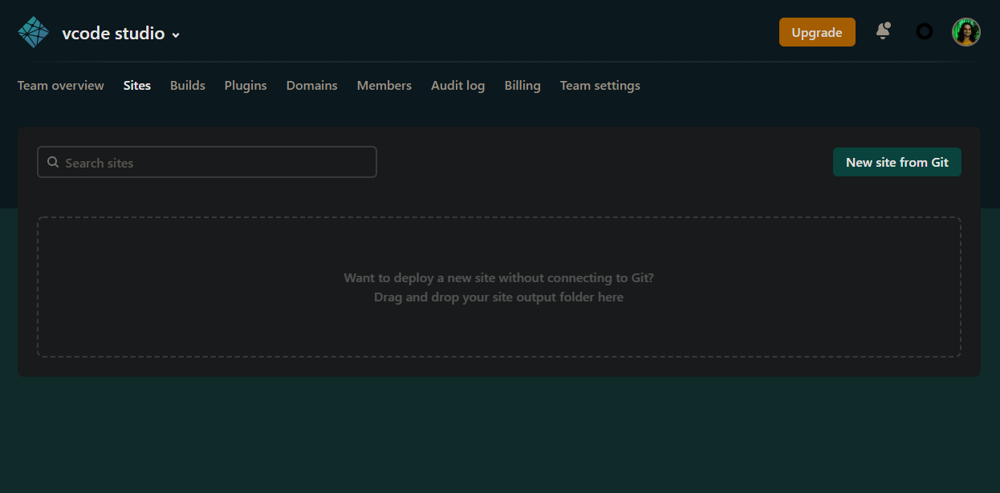
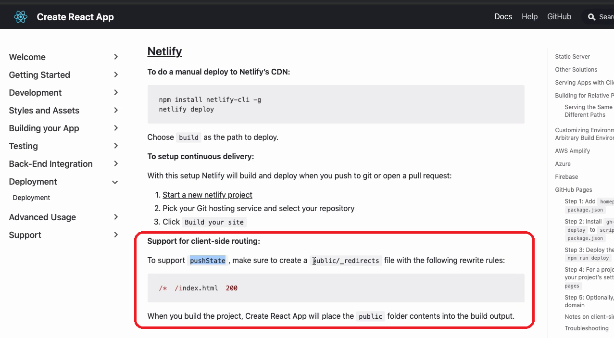

# Deploy no React (web)

Os sites feitos em React são estáticos, eles não precisam de servidor pra
renderizar, como Node ou PHP. Sites estáticos são mais baratos de serem
hospedados. Existem diversas opções gratuitas, na própria documentação do React
mostra <https://create-react-app.dev/docs/deployment>. Do q o professor falou,
os melhores são:

- S3 da Amazon. É pago mas muito barato e o melhor
- Netlify. É gratuito e muito bom

Vamos deployar pelo `Netlify`. Cada um tem um jeito específico de fazer deploy,
então, não ache q os comandos a seguir servem para outros servidores. Não. Serve
apenas pro Netlify.

## Netlify

Vc pode deployar pelo CLI, mas o servidor possui uma interface gráfica mt boa.
Entre no Netlify <https://www.netlify.com/>, cadastre, crie um novo projeto, e
vá em `sites`



Pro netlify deployar, vc vai precisar ter o código no github (ou bitbucket, ou
gitlab).


Vai aparecer um domínio temporário. Vc pode facilmente configurar um domínio.
Este domínio temporário, se vc acessar alguma rota e der um F5, não vai
recarregar a página, isto pq o netlify ainda não reconhece suas rotas. Pra ele
reconhecer, basta colocar uma regrinha, q está descrito na doc do
create-react-app:



Crie o arquivo `_redirects` na pasta `public`.

## public/\_redirects

```any
/*  /index.html  200
```

Comita e dê um push. O Netlify já tem CI integrada. Assim q vc comita no github,
ele já deploya automaticamente. Não precisa criar as etapas de automatizar, como
foi feito na Digital Ocean. Aqui é pronto já.
