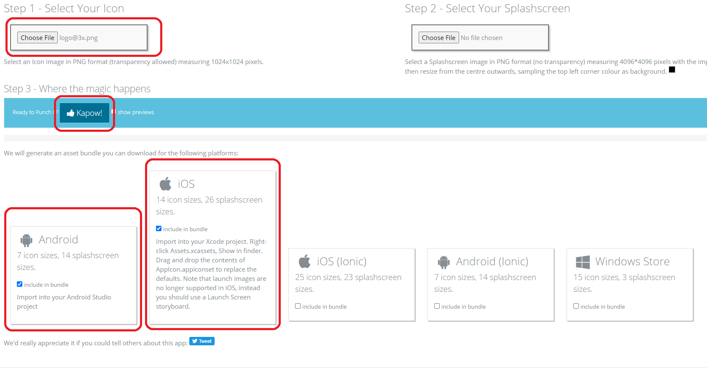

# Configurações visuais no Android

Faremos:

- Nome da aplicação
- ícone
- splash screen
- ID da aplicação

## Nome do app

### android/app/src/main/res/values/strings.xml

```diff
<resources>
-    <string name="app_name">gobarber_mobile</string>
+    <string name="app_name">Go Barber</string>
</resources>
```

## Ícone do app

### Gere o ícone

Tem uma plataforma q renderiza o ícone do tamanho correto, se chama
`Ape Tools - Image Gorilla`.
Acesse: <https://apetools.webprofusion.com/#/tools/imagegorilla>

> **O site explicita q o ideal é mandar uma imagem PNG de 1024x1024**

Escolha uma imagem png 1024x1024.



Selecione `Android` e `iOS`.

Dê um `Kapow!`

### Substitua o ícone original pelo gerado

Extraia o arquivo zipado gerado.

Do arquivo gerado, em `bundle/Android`, copie todas as pastas q começam com o
nome `drawable`. Cole em `android/app/src/main/res` e delete todas as pastas
`mipmap`.

#### android/app/src/main/AndroidManifest.xml

```diff
<manifest xmlns:android="http://schemas.android.com/apk/res/android"
  package="com.gobarber_mobile">

    <uses-permission android:name="android.permission.INTERNET" />

    <application
      android:name=".MainApplication"
      android:label="@string/app_name"
-      android:icon="@mipmap/ic_launcher"
-      android:roundIcon="@mipmap/ic_launcher_round"
+      android:icon="@drawable/icon"
+      android:roundIcon="@drawable/icon"
      android:allowBackup="false"
      android:theme="@style/AppTheme">
      <activity
        android:name=".MainActivity"
        android:label="@string/app_name"
        android:configChanges="keyboard|keyboardHidden|orientation|screenSize|uiMode"
        android:launchMode="singleTask"
        android:windowSoftInputMode="adjustResize">
        <intent-filter>
            <action android:name="android.intent.action.MAIN" />
            <category android:name="android.intent.category.LAUNCHER" />
        </intent-filter>
      </activity>
      <activity android:name="com.facebook.react.devsupport.DevSettingsActivity" />
    </application>

</manifest>
```

> É `icon` em vez de `ic_launcher` pq esse é o nome do arquivo em
> `android/app/src/main/res/drawable`

## Splash Screen

O splash screen é a tela de carregando no momento q abre o app.

O Ape Tools fornece um gerador de splash screen. Se vc quiser q apareça uma
imagem, pode gerar pelo site. O professor prefere q apareça o ícone com uma cor
de fundo. Não vou fazer pelo Ape Tools, e sim na unha:

Crie o arquivo `colors.xml` em `android/app/src/main/res/values/`.

### android/app/src/main/res/values/colors.xml

```xml
<?xml version="1.0" encoding="utf-8" ?>

<resources>
  <color name="primary">#7159c1</color>
</resources>
```

Crie o arquivo `background_splash.xml` em `android/app/src/main/res/drawable/`.

### android/app/src/main/res/drawable/background_splash.xml

```xml
<?xml version="1.0" encoding="utf-8" ?>

<layer-list xmlns:android="http://schemas.android.com/apk/res/android">
  <item android:drawable="@color/primary" />

  <item android:height="200dp"
    android:width="200dp"
    android:drawable="@drawable/icon"
    android:gravity="center"
  />
</layer-list>
```

### android/app/src/main/res/values/styles.xml

```diff
<resources>

    <!-- Base application theme. -->
    <style name="AppTheme" parent="Theme.AppCompat.Light.NoActionBar">
        <!-- Customize your theme here. -->
        <item name="android:textColor">#000000</item>
    </style>

+    <style name="SplashTheme" parent="Theme.AppCompat.Light.NoActionBar">
+
+        <item name="android:windowBackground">@drawable/background_splash</item>
+    </style>
</resources>
```

#### android/app/src/main/AndroidManifest.xml

```diff
<manifest xmlns:android="http://schemas.android.com/apk/res/android"
  package="com.gobarber_mobile">

    <uses-permission android:name="android.permission.INTERNET" />

    <application
      android:name=".MainApplication"
      android:label="@string/app_name"
      android:icon="@drawable/icon"
      android:roundIcon="@drawable/icon"
      android:allowBackup="false"
      android:theme="@style/AppTheme">
      <activity
+        android:theme="@style/SplashTheme"
        android:name=".MainActivity"
        android:label="@string/app_name"
        android:configChanges="keyboard|keyboardHidden|orientation|screenSize|uiMode"
        android:launchMode="singleTask"
        android:windowSoftInputMode="adjustResize">
        <intent-filter>
            <action android:name="android.intent.action.MAIN" />
            <category android:name="android.intent.category.LAUNCHER" />
        </intent-filter>
      </activity>
      <activity android:name="com.facebook.react.devsupport.DevSettingsActivity" />
    </application>

</manifest>
```

## Configurar ID do pacote da aplicação

### android/app/build.gradle

Vc vai mudar o `applicationId` com o seguinte padrão:

`applicationId "com.nome_da_empresa.nome_do_app"`

Se não tiver nome de empresa tudo bem.

```diff
...

def enableHermes = project.ext.react.get("enableHermes", false);

android {
    compileSdkVersion rootProject.ext.compileSdkVersion

    compileOptions {
        sourceCompatibility JavaVersion.VERSION_1_8
        targetCompatibility JavaVersion.VERSION_1_8
    }

    defaultConfig {
-        applicationId "com.gobarber_mobile"
+        applicationId "com.vcoder.gobarber"
        minSdkVersion rootProject.ext.minSdkVersion
        targetSdkVersion rootProject.ext.targetSdkVersion
        versionCode 1
        versionName "1.0"
    }
    splits {
        abi {

...
```
