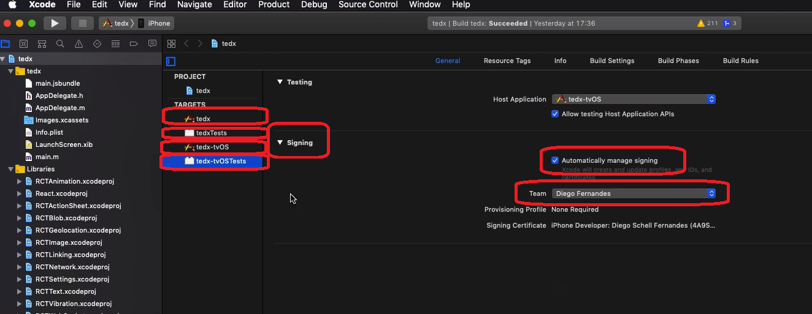

# Configurações visuais no iOS

Faremos:

- Nome da aplicação e ID do pacote dentro do iOS
- ícone
- splash screen
- Orientação Portrait/Landscape

> **Diferente do Android, as configurações do iOS são feitas dentro do `xcode`, q só roda no Mac.**

Em `ios/gobarber_mobile.xcodeproj`, abra o projeto no `xcode`.

> No exemplo abaixo é um app do professor chamado Ted X

No xcode, clicando no ícone do menu lateral:

Em todos os `TARGETS` procure pelo `Signing` e deixe marcado
`Automatically manage signing`, e sempre preencha também o `Team` com um time
selecionado.

## Nome da aplicação

Troque o nome da aplicação e o `Bundle Identifier`. O `Bundle Identifier` é
o mesmo valor q o `application Id` do Android: `com.nome_da_empresa.nome_do_app`

## Ícone da aplicação

No xcode, na pasta `Images.xcassets` do seu projeto, selecione a opção
`AppIcon`.

Daquele arquivo gerado pelo Ape Tools, em `bundle\iOS\AppIcon.appiconset` vc
verá diversos tamanhos do ícone. Coloque-os no `AppIcon` nos locais adequados
aos tamanhos.

## Splash Screen

Deixe a imagem q vc quer q apareça no splash screen disponível. Para isso, pegue
a imagem e coloque na pasta `Images.xcassets` do seu projeto no xcode. Vão
aparecer 3 tamanhos. Vc não precisa preencher os 3. No exemplo abaixo, o arquivo
`icon.png` foi colado em `Images.xcassets`.

No xcode, selecione o arquivo `LaunchScreen.xib`. O programa vai pedir qual
dispositivo emular, selecione um iPhone padrão mesmo. Vai aparecer uma tela com
uma imagem.

Delete os textos da tela, deixe limpa.

Para mudar a cor do background, vá no 4º ícone lá em cima à direita. Em
`Background`, mude a cor.

Insira um `Image View` na tela. Para isso, clique no ícone lá em cima na
direita, procure por `Image`, e selecione `Image View`.

Alinhe arrastando a `UIImageView` usando as linhas-guia da tela.

Selecionando a `UIImageView`, aparecerá um menu lateral. Se vc tiver colocado a
imagem no `Images.xcassets` como disse um pouco acima, vai em `Image` de
`Image View` e selecione a imagem q vc carregou.

Em `Content Mode`, deixe `Aspect Fit`.

Altere o efeito responsivo do splash screen. Lá no quinto ícone lá em cima (tipo
uma régua), vá em `Autoresizing`.

Desmarque os espaçamentos topo e esquerda, e
selecione os 2 internos horizontal e vertical.

## Orientação vertical/horizontal da tela

Pra dizer se o app é só Portrait, ou só Landscape, ou os dois, vc vai trocar
no projeto principal no xcode.

