# Configurando o One Signal

O One Signal é uma plataforma q permite lançar notificações no app sem q o usuário esteja mexendo.

O One Signal vale tanto pra Android qnt pra iOS. Inicialmente precisamos configurar umas tetas no portal da Apple. Apps iOS precisam ser configurados no portal da Apple pra gerar o certificado pra desenvolvimento e produção. Apps Android não precisam.

## Configurando App no portal da Apple

No portal <developer.apple.com>, vá em `Certificates, Identifiers & Profiles`.

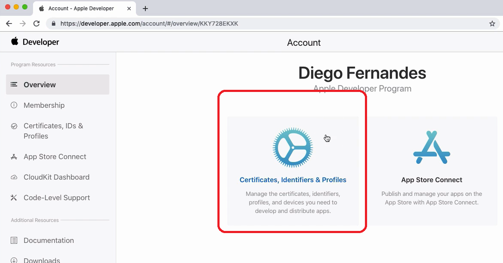

Vá em `App IDs` e clique no botão +

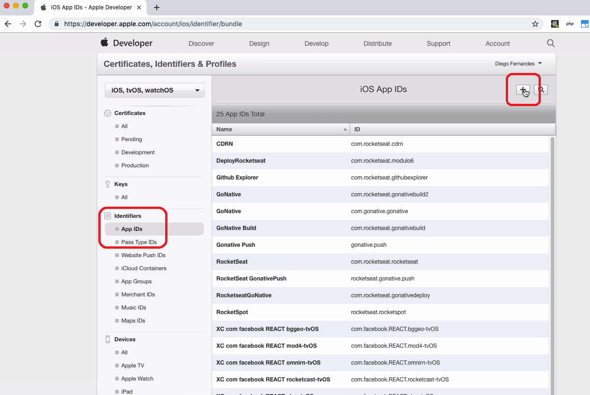

Coloque o nome verdadeiro da aplicação, podendo usar maiúsculas e espaço.

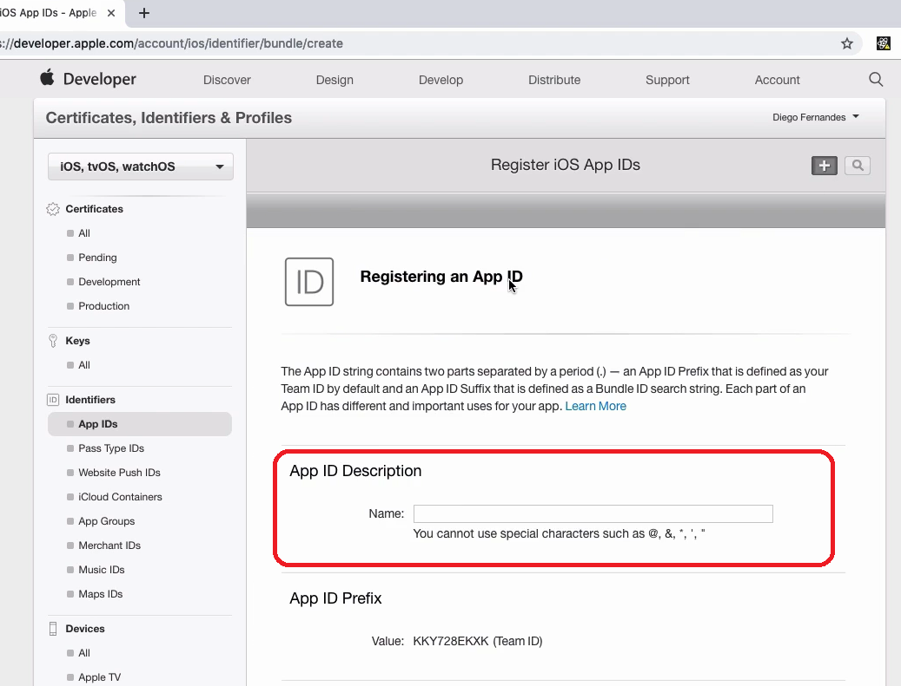

Coloque o bundle ID. Este é o `Bundle Identifier` q vc configurou no xcode, o
mesmo do `application Id` do Android. Seu formato é assim:
`com.nome_da_empresa.nome_do_app`

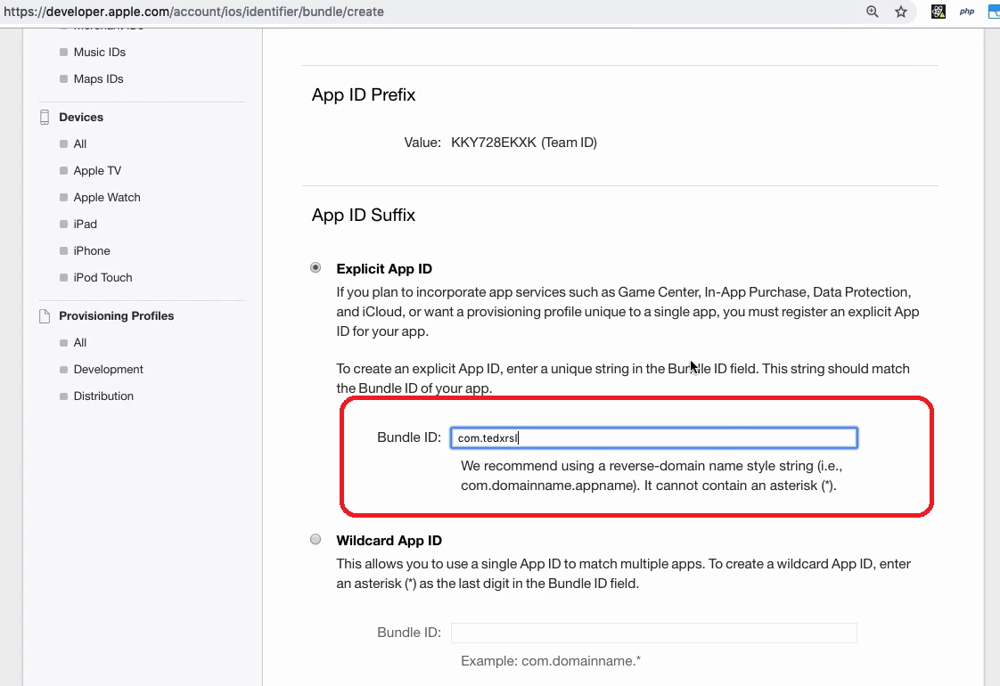

Mais abaixo, existem uma série de opções q vc pode deixar habilitado no app,
como iCloud, Wallet, etc. O professor não marcou nenhuma das opções.

Clique em Continue > Register > Done.

## Push Notifications do One Signal

`Push Notifications` são aquelas notificações q chegam pro usuário mesmo se o app tiver fechado. Vamos criar as push notifications pela ferramenta `One Signal`. É uma ferramenta gratuita e sem limites de pushs.

Visite: <https://github.com/OneSignal/react-native-onesignal>

Tenha uma conta no portal do One Signal e instale a lib no projeto:

`yarn add react-native-onesignal`

RN versão < 0.60 precisa linkar:

`react-native link react-native-onesignal`

### Configurando One Signal no Android

#### android/app/src/main/AndroidManifest.xml

```diff
<manifest xmlns:android="http://schemas.android.com/apk/res/android"
  package="com.gobarber_mobile">

    <uses-permission android:name="android.permission.INTERNET" />

    <application
      android:name=".MainApplication"
      android:label="@string/app_name"
      android:icon="@drawable/icon"
      android:roundIcon="@drawable/icon"
      android:allowBackup="false"
      android:theme="@style/AppTheme">
      <activity
+        android:launchMode="singleTop"
        android:theme="@style/SplashTheme"
        android:name=".MainActivity"
        android:label="@string/app_name"
        android:configChanges="keyboard|keyboardHidden|orientation|screenSize|uiMode"
        android:launchMode="singleTask"
        android:windowSoftInputMode="adjustResize">
        <intent-filter>
            <action android:name="android.intent.action.MAIN" />
            <category android:name="android.intent.category.LAUNCHER" />
        </intent-filter>
      </activity>
      <activity android:name="com.facebook.react.devsupport.DevSettingsActivity" />
    </application>

</manifest>
```

#### android/app/build.gradle

> Atenção, não é o build.gradle do root do folder android. É o de android/app/

Na documentação do One Signal, pede pra inserir uns códigos no **topo do arquivo**.

```diff
+buildscript {
+    repositories {
+        gradlePluginPortal()
+    }
+    dependencies {
+        classpath 'gradle.plugin.com.onesignal:onesignal-gradle-plugin:[0.12.10, 0.99.99]'
+    }
+}
+
+apply plugin: 'com.onesignal.androidsdk.onesignal-gradle-plugin'

apply plugin: "com.android.application"

import com.android.build.OutputFile

/**
 * The react.gradle file registers a task for each build variant (e.g. bundleDebugJsAndAssets
 * and bundleReleaseJsAndAssets).
 * These basically call `react-native bundle` with the correct arguments during the Android build
 * cycle. By default, bundleDebugJsAndAssets is skipped, as in debug/dev mode we prefer to load the
 * bundle directly from the development server. Below you can see all the possible configurations
 * and their defaults. If you decide to add a configuration block, make sure to add it before the
 * `apply from: "../../node_modules/react-native/react.gradle"` line.

...
```

### Adicionando app no One Signal

#### iOS

> Eu não consegui configurar a parte iOS, pois não consegui fazer um Apple ID. A parte iOS é tela printada do curso

No portal <https://app.onesignal.com/>, faça login e adicione um novo App. Escolha uma plataforma q use o app. O professor começou pela Apple:

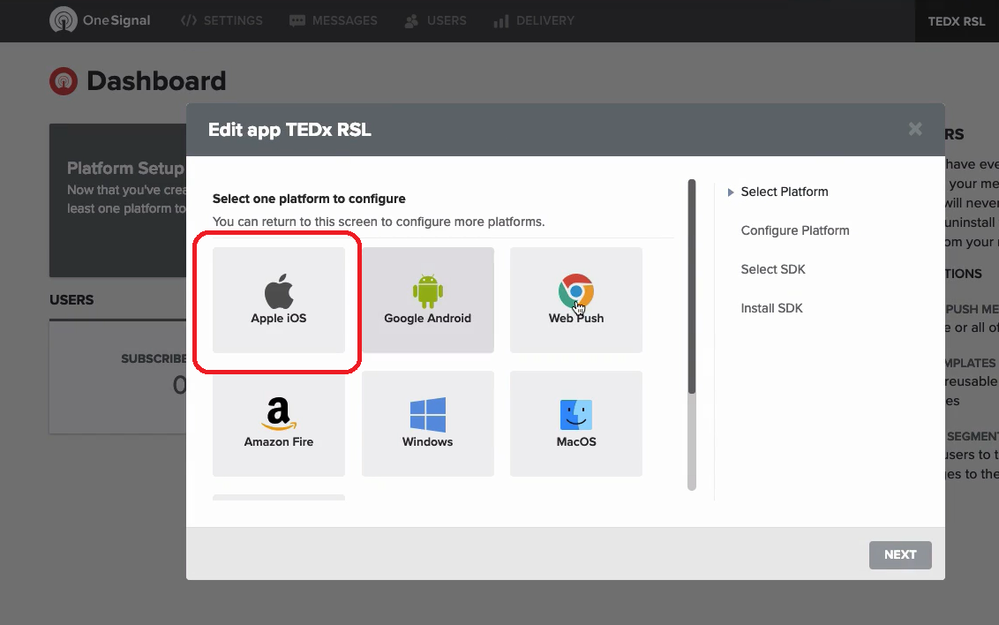

O One Signal vai pedir o certificado de produção `.p12`. Um jeito de conseguir esse certificado é usando a ferramenta `Provisionator` do `One Signal`.

Acesse: <https://onesignal.com/provisionator>

Clique em `Get Started`. Coloque suas credenciais da Apple (Apple ID e password). Coloque seu Time, e selecione o App (só vai aparecer se vc tiver feito aquela configuração acima no portal da Apple). Clique em `Generate`.

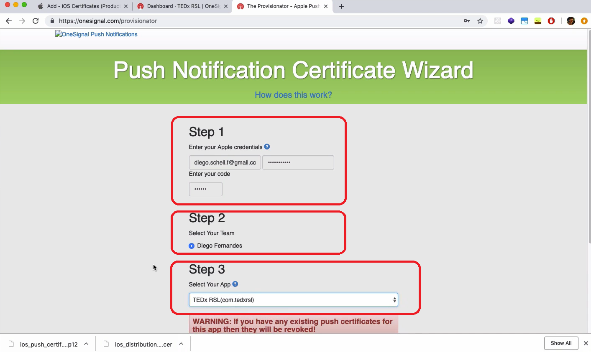

O Provisionator vai gerar 3 certificados. O q importa é o primeiro.

> Repare q ele tb deu uma senha. Vc vai precisar dela no One Signal

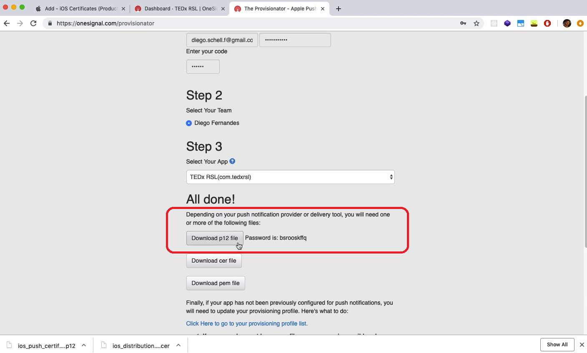

Faça upload do certificado no One Signal. Use a senha gerada pelo provisionator:

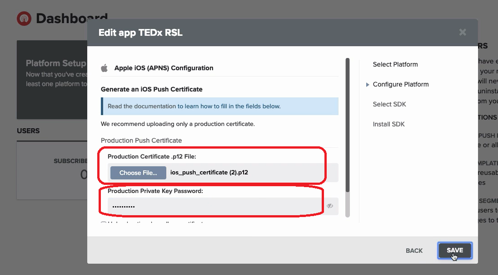

Dê um Save e feche o setup.

##### xcode

Abra o xcode, vá na aplicação. Vá na aba `Capabilities` e marque a flag `Push Notifications`:

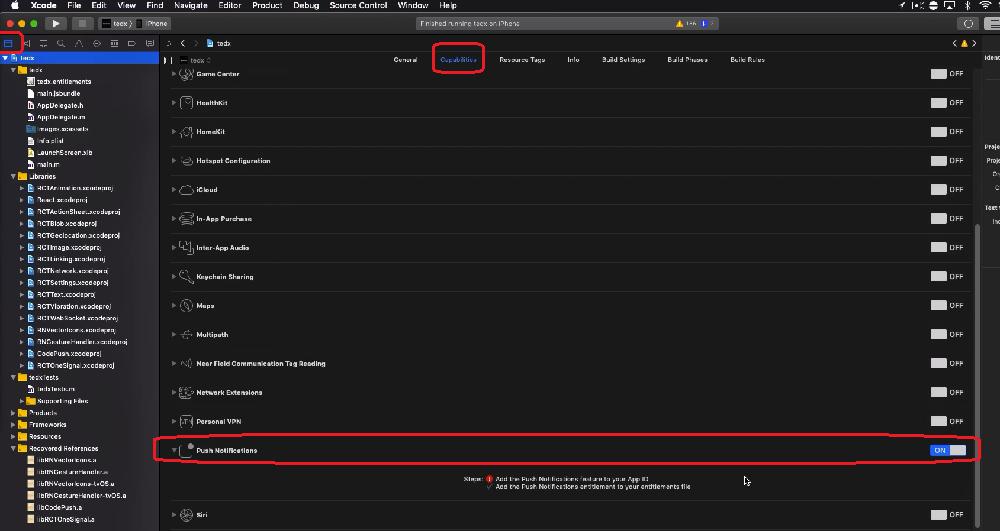

Marque tb a flag `Background Modes`, e nela, a opção `Remote notifications`:

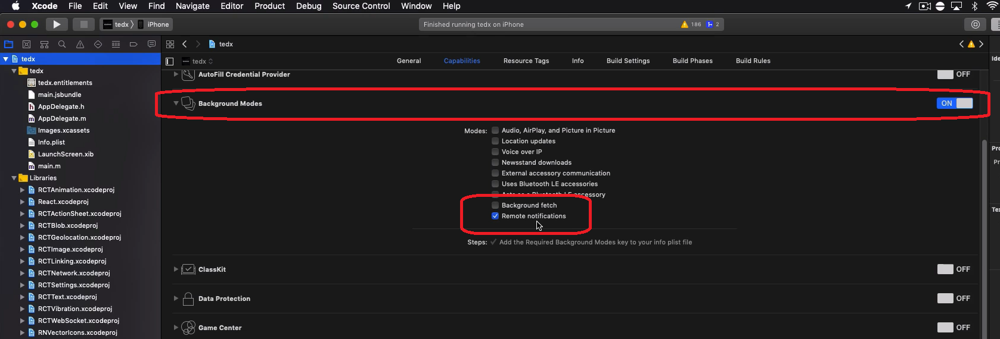

#### Android

Com a parte iOS configurada, vá em `Settings` no portal OneSignal:

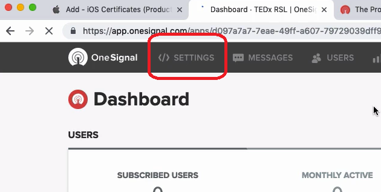

Selecione `Google Android` em `Native App Platforms`:

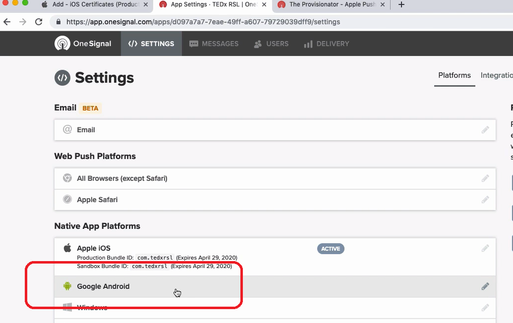

O One Signal vai pedir o `Firebase Server Key` e o `Firebase Sender ID`.

Acesse o Firebase: <https://console.firebase.google.com/>

Logue. Adicione um projeto. Dê um nome a ele.

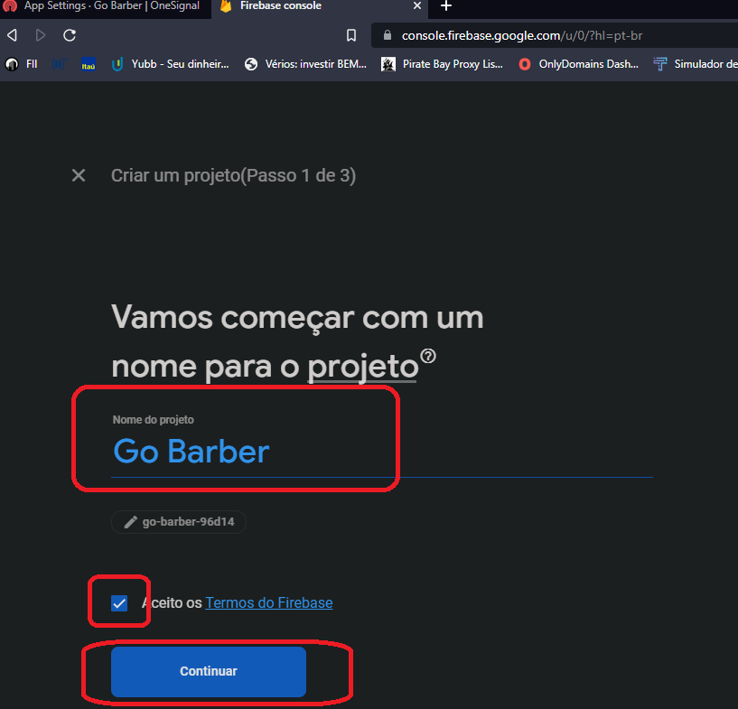

No Firebase, vá em `Configurações do projeto`:

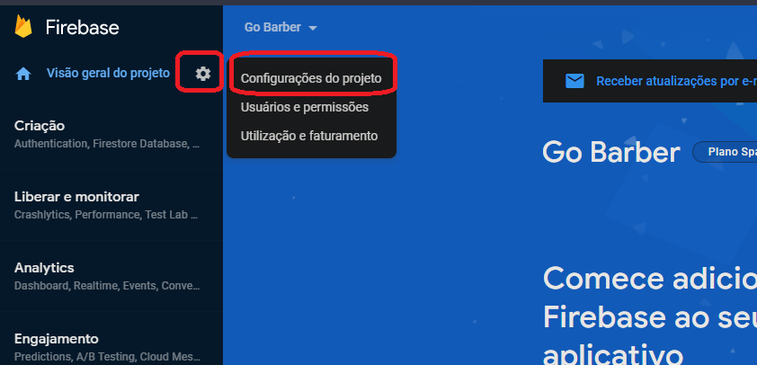

Vá em `Cloud Messaging e pegue a chave do servidor e ID do remetente:

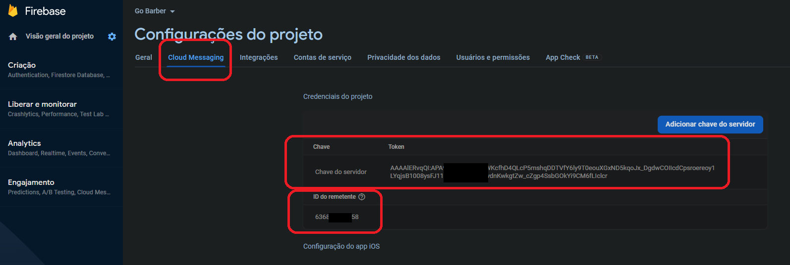

No One Signal, cole a `chave do servidor` em `Firebase Server Key`, e o `ID do remetente` em `Firebase Sender ID`. Dê um Save:

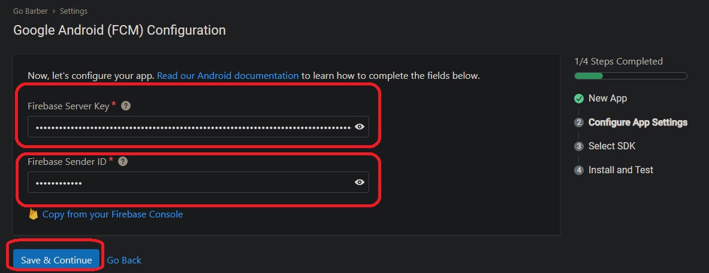

O One Signal oferece pra configurar SDK, RN... mas o professor não mexeu nisso, apenas Firebase.
