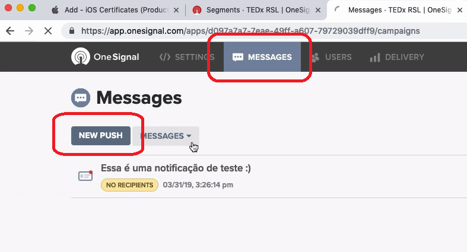

<!-- TOC -->

- [Enviando notificações push](#enviando-notifica%C3%A7%C3%B5es-push)
  - [src/index.js](#srcindexjs)
  - [Enviando notificações](#enviando-notifica%C3%A7%C3%B5es)

<!-- /TOC -->

# Enviando notificações push

Instale a lib do One Signal:

`yarn add react-native-onesignal`

## src/index.js

Na plataforma do OneSignal, copie o `App ID` em `Settings > Keys & IDs` e cole no projeto. Pra isso, eu vou transformar a função Index em stateful component, pra eu ter o recurso de dar um `OneSignal.init`.

Também vou criar 3 `event listeners` pro OneSignal. É importante vc remover esses eventos qnd desmonta o render. Por isso, tb vai ter um `componentWillUnmount`.

- onReceived: vai rodar toda vez q o usuário receber notificação e o app estiver aberto.
- onOpened: roda qnd o usuário clica na notificação com o app fechado.
- onIds: roda na primeira vez q o user abre o app. Serve pra enviar notificações pra usuários específicos.

> Apesar de eu estar fazendo com o Index do src, eu poderia fazer com o arquivo App.js

```diff
import React from 'react';
import { StatusBar } from 'react-native';
import CodePush from 'react-native-code-push';
import { Provider } from 'react-redux';

import { PersistGate } from 'redux-persist/integration/react';

// eslint-disable-next-line import-helpers/order-imports
import App from './App';
import './config/ReactotronConfig';

import { store, persistor } from './store';

const Index = () => (
  <Provider store={store}>
    {/* PersistGate pega o estado antes de renderizar o q tem dentro */}
    <PersistGate persistor={persistor}>
      <StatusBar barStyle="light-content" backgroundColor="#7159c1" />
      <App />
    </PersistGate>
  </Provider>
);

export default CodePush({
  checkFrequency: CodePush.CheckFrequency.ON_APP_RESUME,
})(Index);
```

## Enviando notificações

No portal do One Signal, depois q vc rodar o app, vai aparecer o primeiro user. Vá em `Messages` e clique um `New Push`:



Vão aparecer diversas configurações diferentes pra iOS e pra Android, como som, mídia, imagem, cores, etc.

Mais abaixo tem o `Launch URL`, caso vc queira abrir determinada parte do app através de um link de navegador.

Dá pra ter botões tb.

Escreva uma msg, coloque um título, e envie a notificação.
