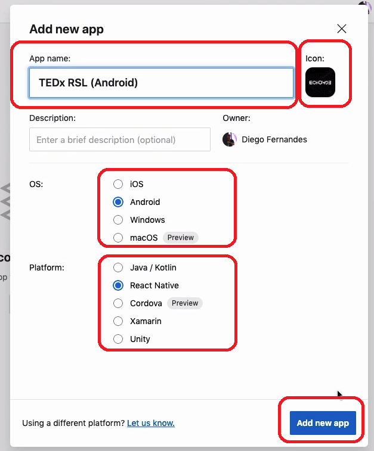

# Configurando o Appcenter

O Appcenter é uma plataforma da Microsoft. É o appcenter q libera o `Code Push`.

Instale a lib do appcenter de forma global:

`yarn global add appcenter-cli`

Crie uma conta no portal do appcenter.

## Login pelo terminal

Logue no Appcenter pelo terminal:

`appcenter login`

No terminal, vai aparecer um link pra clicar. Vai abrir uma janela com um token. Este token, cole no terminal em `Access code from browser`.

Pra testar, liste seus projetos do appcenter: `appcenter apps list`.

## Crie novo app

Vc vai ter q criar 2 novos apps no appcenter. Um pra iOS e um pra Android.

Após criar, vai aparecer uma tela de instruções de instalação de umas funcionalidades. Vc não precisa instalá-las, apenas se quiser usá-las. São elas:

- Diagnostics
- Analytics
- Push

Só instale se quiser.

Crie o segundo app do mesmo jeito.
