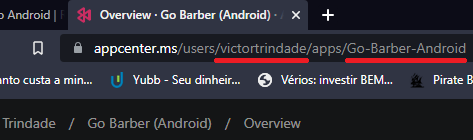

# Configurando ambiente no Android

Vc até agora trabalhou com 2 ambientes: `Desenvolvimento` e `Produção`. Agora vc vai ver um terceiro ambiente, o `Staging`. O `staging` é o ambiente onde vc testa a aplicação em produção, porém sem ter usuários externos. Isso permite fazer testes nas atualizações antes de entrar pro ar.

## Liberar Code Push no Appcenter

Libere o Code Push pelo Appcenter. Faça com os 2 apps. É bem fácil. No appcenter, selecione o app > Distribute > Code Push > Create standard deployments.


Repita pro outro app.

## Chave do app no appcenter

Vc vai precisar listar suas chaves pra iOS e pra Android. Pegue o nome da **Organização** e do **App** na URL do app no appcenter:



Veja as chaves do app:

`appcenter codepush deployment list -a <nome_da_empresa>/<nome_do_app> -k`

Ficou assim o meu:
`appcenter codepush deployment list -a victortrindade/Go-Barber-Android -k`

## android/app/build.gradle

> Essa config só vale pra RN > 0.60. Se quiser config <= 0.60, veja na aula. O daqui não é da aula

```diff
...

    project.ext.react = [
        enableHermes: false,  // clean and rebuild if changing
    ]

    apply from: "../../node_modules/react-native/react.gradle"
+    apply from: "../../node_modules/react-native-codepush/android/codepush.gradle"

...

    buildTypes {
        debug {
+            buildConfigField "String", "CODEPUSH_KEY", '""'
            signingConfig signingConfigs.debug
        }

+        releaseStaging {
+            buildConfigField "String", "CODEPUSH_KEY", '"94RluCfFTfeR7VzXALazi-VIyvMoRxmejf1eh"'

            // matchingFallbacks = ['debug', 'release']
+        }

        release {
+            buildConfigField "String", "CODEPUSH_KEY", '"A5NkfBqon4H92i2HtAhIowZU4MBhXkngzXhP6"'

            // Caution! In production, you need to generate your own keystore file.
            // see https://reactnative.dev/docs/signed-apk-android.
            signingConfig signingConfigs.debug
            minifyEnabled enableProguardInReleaseBuilds
            proguardFiles getDefaultProguardFile("proguard-android.txt"), "proguard-rules.pro"
        }
    }

...
```

## android/app/src/main/java/com/gobarber_mobile/MainApplication.java

```diff
...

import com.facebook.react.ReactApplication;
+import com.microsoft.codepush.react.CodePush;
import com.BV.LinearGradient.LinearGradientPackage;
import com.facebook.react.ReactInstanceManager;

...

private final ReactNativeHost mReactNativeHost =
      new ReactNativeHost(this) {
        @Override
        public boolean getUseDeveloperSupport() {
          return BuildConfig.DEBUG;
        }

        @Override
        protected List<ReactPackage> getPackages() {
          @SuppressWarnings("UnnecessaryLocalVariable")
          List<ReactPackage> packages = new PackageList(this).getPackages();
          // Packages that cannot be autolinked yet can be added manually here, for example:
          // packages.add(new MyReactNativePackage());
          return packages;
        }

        @Override
        protected String getJSMainModuleName() {
          return "index";
        }

+        @Override
+        protected String getJSBundleFile() {
+          return CodePush.getJSBundleFile();
+        }
      };

  @Override
  public ReactNativeHost getReactNativeHost() {
    return mReactNativeHost;
  }

...
```

## android/app/src/main/res/values/strings.xml

```diff
<resources>
    <string name="app_name">Go Barber</string>

+    <string moduleConfig="true" name="CodePushDeploymentKey">BuildConfig.CODEPUSH_KEY</string>
</resources>
```

<!-- ## Commit branch staging e build no App Center

Crie o branch `staging` no Github. Commite tanto pro staging qnt pro master, e dê push.

No App Center, realize o build. -->
