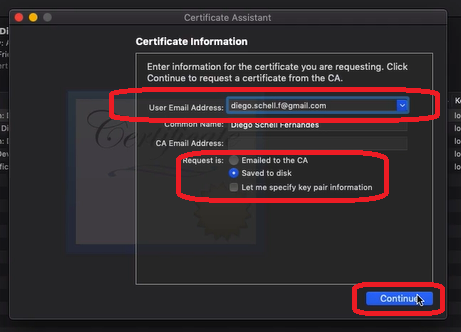
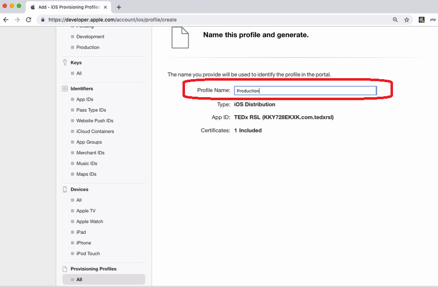

# Configurando ambiente no iOS

No Mac, procure por `Keychain Access`. Lá, vá em `Certificate assistant` > `Request certificate from a certificate Authority...`:

Preencha seu e-mail, selecione `Saved to disk` e dê um continue:

Escolha a pasta q desejar. O professor preferiu criar uma pasta `Apple` pq daqui pr frente serão vários arquivos q a Apple vai exigir. O nome do arquivo é indiferente. O professor trocou o nome de `CertificateSigningRequest.certSigningRequest` pra `CSR.certSigningRequest`.

Acesse <https://developer.apple.com>. Vá em Account > Certificates > Production > Adicione um novo certificado:

Marque `App Store and Ad Hoc` > `Continue`:

Faça upload do certificado gerado:

Faça o Download do certificado pronto:

Clique no certificado baixado, e dê um `export`:

Fique atento ao formato `.p12`. O Professor salvou com o nome `Producao`. No momento de salvar, pede pra gerar uma senha pra ele, e tb pede a senha do PC. Em vez de `Allow`, clique em `Always Allow`.

No portal da Apple, vá em `Provisioning Profiles` > `All`:

Adicione um novo provisionamento:

O primeiro perfil de provisionamento será o `iOS App Development` > Continue:

Em `App ID`, selecione seu app (é pra aparecer lá no combobox) > Continue. Selecione o certificado de desenvolvimento. Selecione os dispositivos de iPhone (Select All) > Preencha o nome (Development) > Continue:

Faça download desse certificado pra mesma pasta Apple q já tá o outro.

Gere mais 2 certificados de provisionamento. O primeiro deles será o `Ad Hoc`:

Mesmo procedimento q o anterior: selecione o app no combobox, selecione o certificado, selecione iPhone e coloque um nome (AdHoc) > Continue > Download:

Vamos gerar o último certificado. Provisioning Profiles > All > + > Selecione `App Store`:

Mesmo procedimento q os anteriores: selecione o app no combobox, selecione o certificado, selecione iPhone e coloque um nome (Production) > Continue > Download:

Como não estamos desenvolvendo pra tvOS, vamos deletar os 2 targets pra tv no xcode só pra não atrapalhar:

Em Project no xcode, vá em Configurations > Release > + > `Duplicate "Release" Configuration`:

Chame de `Staging` essa nova Release.

Configure o Staging pra ter as mesmas configurações do Release. Para isso, no projeto do xcode, vá em `Build Settings`. Deixe as opções `All` e `Levels` selecionadas. Procure na barra de busca por `per-configuration`. Em `Per-configuration Build Products Path`, vá em `Staging`:

Dê duplo clique no `build/Staging-iphoneos` que está na coluna do projeto. O valor q aparecerá será `$(BUILD_DIR)/$(CONFIGURATION)$(EFFECTIVE_PLATFORM_NAME)`. Troque o valor `$(CONFIGURATION)` por `Release`. Ficará assim:

O correto é q fique assim: `build/Release-iphoneos`. Se vc clicar no de cima, tem q aparecer igual:

Apague o q estava na barra de busca. Lá em cima, clique no `+` e em `Add User-Defined Setting`:

Vai aparecer uma nova linha pra acrescentar, nela insira o valor `CODEPUSH_KEY`. Lá em cima, desmarque `Levels` e marque `Combined` pra facilitar a próxima visualização. Ao expandir a linha criada, veremos as linhas Debug, Release e Staging. São nelas q colocaremos nossas Keys do Appcenter. Assim como fizemos pra ver as Keys no Android, faremos igual pra iOS. No terminal, liste suas Keys pra iOS:

`appcenter codepush deployment list -a <nome_da_empresa>/<nome_do_app> -k`

Ficou assim o meu:
`appcenter codepush deployment list -a victortrindade/Go-Barber-iOS -k`

Cole a key de Staging em Staging, e a Production em Release. Debug fica em branco:

(tá acabando...)

Vá em `Info.plist`. Procure pela linha `CodePushDeploymentKey`. Onde está escrito `deployment-key-here`. Troque este valor para `$(CODEPUSH_KEY)`:

Vá em `Product` > `Scheme` > `Manage Schemes...`:

Vc pode deletar a linha do projeto com `tvOS`. Pra isso, selecione a linha, clique em `-` > `Delete`.

Selecione a linha do projeto. Na engrenagem, clique em `Duplicate`:

Renomeie o scheme duplicado pra `nome_do_app-staging`:

Salve. Na tela dos schemes, deixe a opção `Shared` marcada da linha criada. Após, clique em `Edit`:

Dentro de `Run`, vá no combobox `Build Configuration` e deixe marcada a opção `Staging`:

Faça o mesmo em `Archive`:

Volte no projeto do xcode. Em `Signing`, desmarque a opção `Automatically manage signing`. Ao desmarcar, aparecerão 3 grupos abaixo: Signing (Debug), Signing (Release) e Signing (Staging). Em todos eles, vc irá em `Provisioning Profile` > `Import Profile`. Vc vai selecionar aqueles provisionamento salvos anteriormente. Pra `Debug` será `Development`, pra `Release` será `Production` e pra `Staging` será `AdHoc`:

