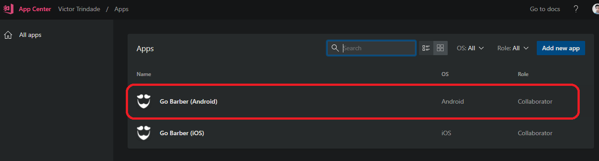
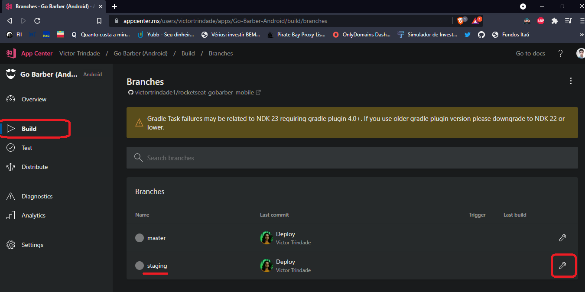
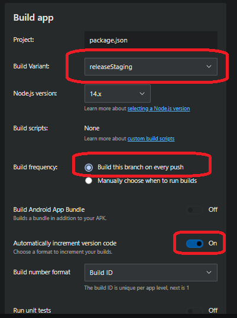
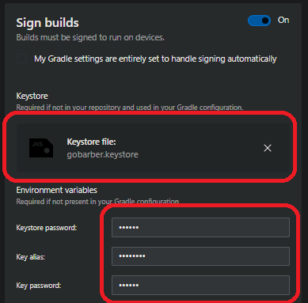
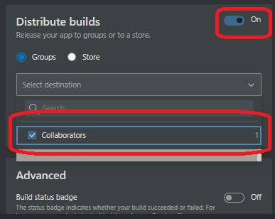

# Distribuindo Staging Android

Vamos fazer a primeira build pra staging no AppCenter.

No AppCenter, vá no app pra Android q vc cadastrou previamente.

Entre em `Build`. Na branch staging, vá nas configurações.

No modal q aparece (Build App), troque pra `releaseStaging` em `Build Variant`. No `Build Frequency`, vc pode deixar marcado se quiser q builda a cada subida pro github. Tb marcou pra cada push ter uma versão única.

> Vc pode também marcar `Run unit tests` se quiser q passe nos testes antes de buildar

## Sign builds

Ainda nas configurações da build do staging no AppCenter, marque a opção `Sign Builds`. Aqui pede pra fazer upload de um arquivo chamado `KeyStore`. Pra conseguir nossa keystore, precisamos gerar com uma ferramenta chamada `keytool` (está na documentação do RN - [veja](https://reactnative.dev/docs/signed-apk-android) ).

Na doc do RN, vc encontra o comando:

`keytool -genkeypair -v -storetype PKCS12 -keystore my-upload-key.keystore -alias my-key-alias -keyalg RSA -keysize 2048 -validity 10000`

onde em `my-upload-key.keystore` vc coloca `<nome_do_app>.keystore`, e no `alias` troca pro nome do app. Ficou assim o meu:

`keytool -genkeypair -v -storetype PKCS12 -keystore gobarber.keystore -alias gobarber -keyalg RSA -keysize 2048 -validity 10000`

Vai pedir pra cadastrar a senha, e uns dados pessoais. Vai gerar o arquivo `gobarber.keystore`. Este é o arquivo q vamos fazer upload no Sign builds. Coloque a senha e alias q vc cadastrou na keystore. Vai pedir mais uma senha, q é na verdade a mesma senha q vc acabou de cadastrar (no pc do professor mostra uma pergunta se quer q seja a msm senha. No meu nao apareceu a pergunta, já foi direto)

## Distribute builds

Marque esta opção. Aqui colocaremos nosso grupo de desenvolvedores. Toda vez q der push no Staging, cada um do grupo será notificado por e-mail, e poderá fazer a instalação sem precisar ir na loja do app.

> Em `Advanced > build status badge` aparece uma flag legal do status da build no Readme.md do github. Marque se quiser.

Dê um `Save and build`.

Se vc verificar seu e-mail, vai ver a versão do app pra instalar no celular no e-mail. Este app será idêntico ao da produção, sendo q este vc tem em mãos antes.
