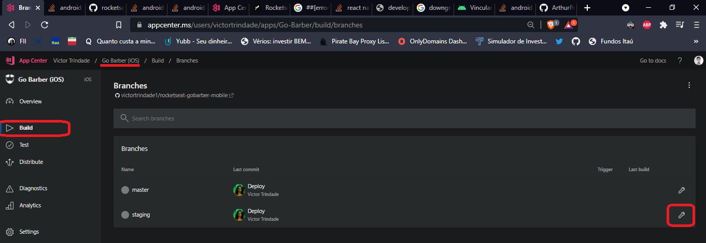
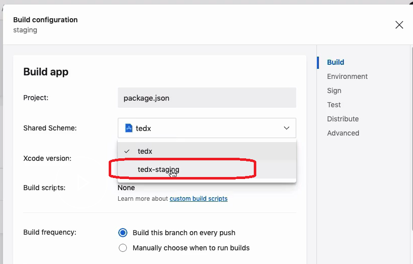
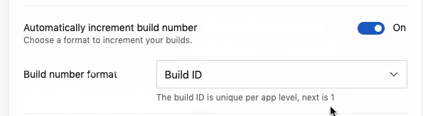
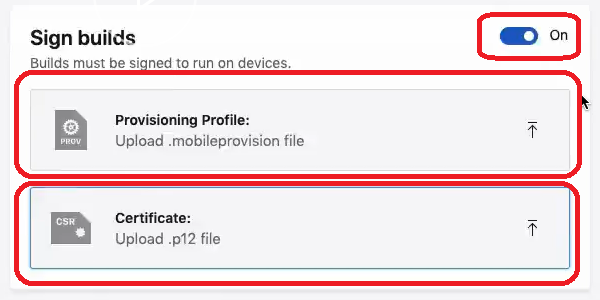
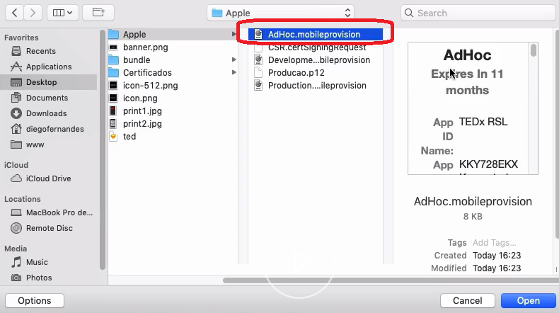
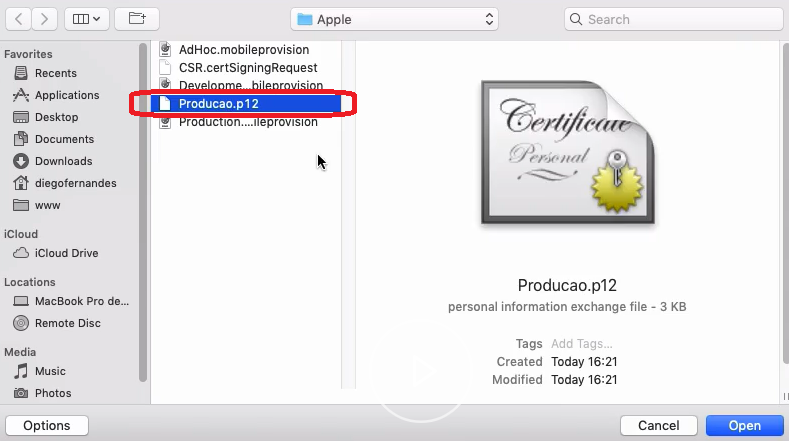
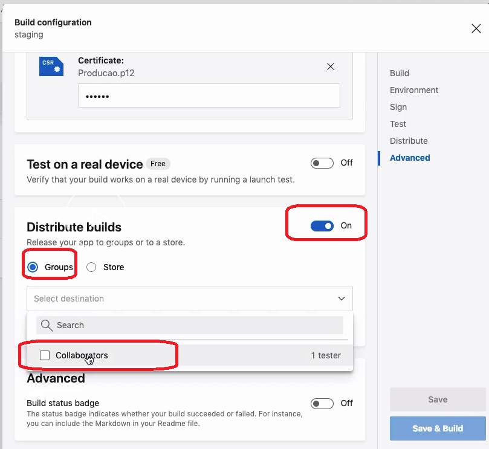

# Distribuindo staging iOS

Aqui vamos distribuir pro grupo de devs o app pronto antes de lançar na plataforma.

No AppCenter, selecione seu app iOS, vá em `Build`, puxe ele do Github. Entre na config.

> Daqui pra frente estou printando o do professor. O app se chama TedX

Em `Shared Scheme`, selecione a versão staging criada no xcode.

Marque `Automatically increment build number`, pra sempre versionar diferente a cada build.

Deixe `Sign builds` marcado. Faça upload do `Provisioning Profile` e o `Certificate`. Vc aprendeu como emití-los no **tópico 5.2 - Configurando ambiente no iOS**. 

Vc possui 3 provisioning profiles (AdHoc, Development, Production). Selecione o `AdHoc`.

Pro certificado, coloque o certificado de produção.

Marque `Distribute builds` > `Groups` > `Collaborators`

Dê um `Save & Build`.

Automaticamente vc e seu grupo receberão um e-mail com o `Install` do app pra iPhone, sem q ele esteja na plataforma pra produção.

> PS: só dá pra abrir a url pra install pelo Safari