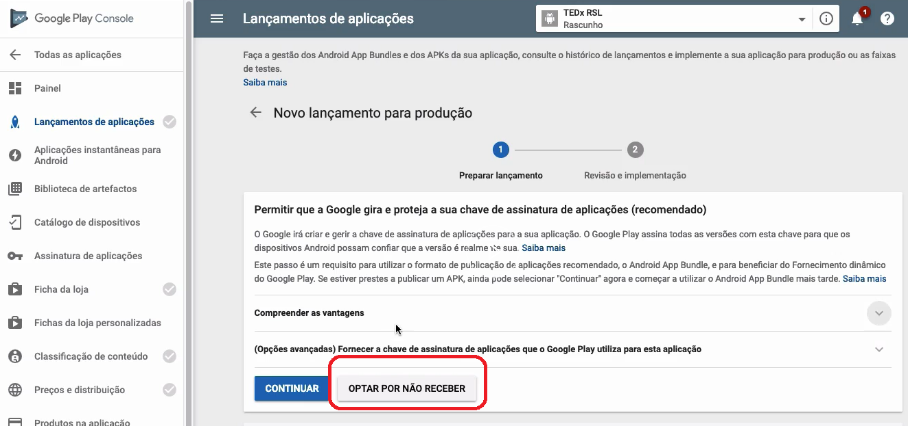

# Publicando app Android

Vamos gerar a primeira versão de release pra loja Play Store.

## Build da versão de Produção

No AppCenter, vá no app Android. Entre em `Build` e clique em Config da branch master.

O procedimento muda quase nada pro procedimento de Staging.

Em `Build Variant`, coloque `release`. Deixe marcado `Automatically increment version code`.

Marque `Sign Builds`. Coloque o `keystore` com as senhas configuradas no **tópico 7.1 - Distribuindo staging Android**.

Em `Distribute builds`, deixe marcado como `Off` por enquanto. Aqui, se marcar pra `Store` já ia buildar pra rolo pra geral. Vamos deixar Off ainda pq tenho q criar o app na Play Store primeiro.

Dê um `Save & Build`.

Dessa build gerada, eu consigo fazer download do `.apk`. Posso até enviar o apk por e-mail pra alguém.

## Google Play Console

Vá em <https://play.google.com/apps/publish>. Antes, vc tem q estar cadastrado (tem q cadastrar cartão de crédito). Vá em `CRIAR APLICAÇÃO`.

Dê um título.

### Lançamentos de aplicações

Vá em `Lançamento de aplicações > Faixa de produção > Produção (GERIR)`.

Clique em `Criar Lançamento`. Aparecerá uma opção do Google gerenciar uma chave de assinatura pra vc. O professor não entrou no assunto e clicou em `Optar por não receber`.

A plataforma vai pedir o apk. Clique em `Procurar ficheiros`, e selecione o apk.

Mais abaixo, em `Quais são as novidades desta versão?`, como é primeira versão, coloque a descrição do app.

### Ficha da loja

No menu lateral, vá em `Ficha da loja`. Em `Detalhes do produto`, cadastre a descrição do app e a descrição completa. Estas são as q aparecem na play store pro usuário final.

Mais abaixo, em `Recursos gráficos`, cadastre uma série de imagens:
  - Capturas das telas do app (`Capturas de ecrã`)
  - Ícone do app em resolução 512 x 512
  - Banner q fica no topo da tela na play store em resolução 1024 x 500 (`Gráfico de funcionalidade`)

Mais abaixo, em `Categorização`, escolha o `Tipo de aplicação` e `Categoria`. 

Em `Detalhes de contacto`, coloque o website (não é obrigatório) e e-mail.

Na `Politica de privacidade`, coloque a URL da sua política de privacidade, q vc vai ter q criar...

Clique em `Guardar rascunho`.

### Classificação de conteúdo

Vá em `Classificação de conteúdo` no menu lateral. Clique em `Continuar`. Vc responderá um questionário, com informações como se seu conteúdo possui sexo, drogas, etc. Ao terminar, clique em `A aplicar`.

### Preços e distribuição

Vá em `Preços e distribuição` no menu lateral. Selecione se o app é pago ou gratuito. Disponibilize o app pro Brasil. Responda um questionário relacionado ao app, como se ele tem anúncios, se o conteúdo é voltado pra criança, etc. Lá embaixo em `Consentimento`, marque que o app cumpre as diretrizes e leis de exportação dos EUA.

Clique em Guardar Rascunho.

### Lançamentos de aplicações - parte 2

Volte pro Lançamento de aplicações. Clique em `Rever`. Veja se está tudo ok. Clique em `Iniciar implementação para produção`.

O processo do google não costuma ser burocrático. Em poucas horas, o app está no ar pra todos.

## Deixando o processo automático

Lá no AppCenter, vá na config da build da branch master pra Android, e agora sim, marque `Distribute builds`. Selecione `Store` > `Connect to Store`

Selecione `Google Play`. Vai pedir um `security token`. Vamos pegá-lo! Siga-me!

### Security token pro google play

Pra pegar o json do security token, volte na plataforma Google Play Console. Vá em `Definições` da tela inicial.

Vá em `Acesso à API` > `Criar conta de serviço`.

Vai aparecer um modal com as instruções pra criar conta de serviço. Clique no link da primeira etapa.

Da página q abre, clique em `+ Criar conta de serviço`.

Dê um nome pra conta de serviço. Pode colocar descrição mas não é obrigatório. Clique em `Criar`.

Em `Permissões`, coloque o papel `Proprietário` > `Continuar`.

Clique em `Criar chave`. Selecione o tipo JSON.

Voltando pro Google Play Console, agora em `Definições > Acesso à API`, conceda acesso à nova conta de serviço criada.

No modal q abre, o professor não mudou nada, nem um e-mail estranho lá em cima. Já foi direto em `Adicionar Utilizador`.

Volte pro AppCenter e faça o upload do security token q vc gerou. Clique em `Connect`.

Coloque o nome do package. Este é o nome do `applicationId` q vc configurou no build.gradle. Foi feito no **tópico 2.1 - Configurações visuais no Android**, em *Configurar ID do pacote da aplicação*. Clique em `Assign`.

Vai aparecer uma lista com Production, Beta e Alpha. Vá na config da branch master em `Build`, e repita o processo feito a pouco: marque `Distribute builds`. Selecione `Store`. Agora, vai aparecer as opções **Production**, **Beta** e **Alpha**. Selecione `Production`. Coloque um textinho pro `Release notes`. Dê um `Save`.

A partir de agora, a cada push no branch master, já vai mudar o app na Play Store automático.

Se quiser usar os recursos de versão Beta e Alpha, o processo é todo o mesmo. Vc vai criar uma branch (ex: Beta), e fazer um `Distribute builds` > `Store` > `Beta`

## Atenção!

Como o processo está automático usando o Code Push do AppCenter, se fizermos uma alteração no Google Play, temos q atualizar no CodePush, pq o usuário fica sempre pegando a última versão do code push. Ou seja, se gerar uma build (tanto pra staging qnt pra master), gere o Code Push junto.
