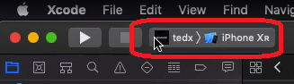
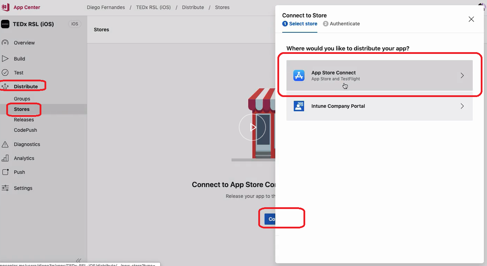

# Publicando app iOS

Vamos publicar o app na App Store.

No portal <https://appstoreconnect.apple.com>, crie um novo app.

Selecione a plataforma `iOS`. 

Dê um nome pro app e idioma. 

No `ID do pacote`, é pra aparecer seu app. Vc cadastrou no portal developer.apple.com (**tópico 3.2 - Configurando One Signal**). 

Em `SKU`, vc pode colocar o nome q quiser.

Em `Acesso de usuário`, deixe `Acesso total`.

Em `Informações do app`, deixe  preenchido o `Nome`, `Subtítulo`, `URL da política de privacidade`, `Categoria`. Clique em `Salvar`

Em `Preços e disponibilidade`, coloque o preço do app na App Store e salve.

Em `Preparar para envio`, vá em `Informações da versão` e faça upload de prints da tela do app. O ideal é configurar todos os modelos.

Preencha o `Texto promocional`, `Descrição`, `Palavras-chave`, `URL de suporte`, `URL de marketing`.

App pra iMessage e Apple Watch pulou pq não tem no app.

Compilação vai ver daqui a pouco.

Mais abaixo em `Informações gerais do app`, coloque o ícone do app (1024 x 1024) e seus dados. Não precisa colocar `Copyright`.

Mais abaixo em `Informações para a equipe de revisão dos apps`, esta é uma das etapas mais importantes do cadastro, pois a Apple é bem exigente. Coloque as informações de contato. Se o app precisa de usuário e senha, marque `Necessário iniciar sessão`, e forneça um usuário e senha acessíveis pra entrar no app. Em `Notas`, tente detalhar o app **o máximo possível**, como se vc estivesse explicando o app pra sua avó!

Em `Liberação da versão`, marque `Liberar automaticamente esta versão`. Salve.

## Compilação

Na página da App Store Connect, em `Preparar para envio > Compilação`, vc não vai conseguir fazer upload do app. Esse upload vc vai fazer por dentro do xcode. Abra o app no xcode. Clique no app lá em cima.

Selecione a opção `Generic iOS Device`.

Gere o bundle do app. Para isso, clique em `Product > Archive`.

Terminando de buildar, dando tudo certo, vai aparecer a tela pra distribuir o app. Clique em `Distribute App`.

Selecione a opção `iOS App Store`.

Selecione `Upload`.

Pode deixar marcadas as flags seguintes.

Selecione o Certificado de Distribuição default. O app selecione o `Production`.

Dê um `Upload`.

Lá na App Store Connect, passados uns 10 minutos, agora a `Compilação` vai estar disponível. Clique em `Selecione uma compilação antes de enviar seu app`.

Selecione a compilação q aparece. Dê um `Salvar`.

Depois de salvo, o botão `Enviar para revisão` fica disponível. Preencha tudo perfeitamente antes de enviar pra revisão. Descrições, tudo. Após tudo terminado, clique em `Enviar pra revisão`.

## Build automático

### Distribute 

Vamos criar a ditribuição de Produção do app. É como um "grupo de produção". Vc pode criar outros grupos (beta, staging...) também. Pra isso, no AppCenter, vá em `Distribute` > `Stores` > `Connect to store` > `App Store Connect`.

Selecione sua conta de desenvolvedor da Apple. Se não tiver, crie uma. Dê um `Connect`. Em `Assign App`, selecione o app. Dê um `Assign`.

### Build

No AppCenter, na config da build da branch master do app iOS (se não sabe chegar, se vira, já printei outras 2 vezes ou mais a tela), em `Shared scheme`, selecione o app de produção. Habilite `Automatically increment build number`.

Habilite `Sign Builds`. Faça o upload do `Provisioning profile de produção` e do `Certificado de produção`. Veja como emitiu no **tópico 5.2 - Configurando ambiente no iOS**.

Habilite `Distribute builds`. Selecione `Store` > `Production`. Escreva qqr coisa no release notes. Dê um `Save`.

Agora, toda vez q vc der um push pro branch master no github, ele já vai upar automático pra App Store. Mas **preste atenção**, a Apple não aceita upar o app automático. O q vai acontecer na real é q qnd vc der push, o appcenter vai criar toda a build e deixar pronta. Daí toda vez vc vai ter q ir na `App Store Connect`, e `Enviar pra revisão` a nova versão q vai aparecer por lá, **sempre manualmente**.

### TestFlight (versão beta)

Se vc quiser criar uma versão beta, crie um branch novo no github, com nome sugestivo (ex: `Beta`). Na plataforma App Store Connect, vá em `TestFlight` e cadastre os grupos dos *testers*.

No AppCenter, na config da build do branch Beta, em `Distribute builds`, selecione a build `TestFlight`. Isto garante q estes usuários receberão instantaneamente a versão assim q for dado push no github (não precisa enviar pra revisão). 

